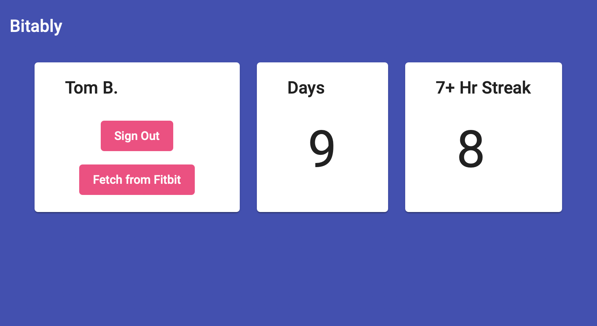

# Bitably app

An app for finding streaks in your Fitbit data, built on Azure.



Solution overview:


## Setting up

Here's how to get the app up and running in your Azure subscription:

### Part 1: Build out the infrastructure

1. The first thing to do is to choose how you'd like to name your Azure resources. Here we'll name our resources using a typical five-part naming scheme:
   
    `environment-region-name-resource-instance`

    For example, the following resource name corresponds to a development environment, in the US East region, called `MyApp`, for the first instance of an Azure Container Registry: `dev-eus-myapp-acr-001`

2. Now that we know how we want to name our resources, the next step is to update the parameters file that supplies the inputs to our ARM template. Open up the `deploy/azuredeploy.parameters.json` file and edit the parameters `nameEnvironment`, `nameRegion`, `nameApp` using VS Code. Be sure to install the Azure Resource Manager (ARM) Tools for Visual Studio Code (Preview) extension so that you get the nice syntax highlighting and linting.

    In addition, set the subdomain of the CDN endpoint (the `cdnEndpointName` parameter) as you like and the API Management service's publishing info `apimPublisherEmail` and `apimPublisherName`. Set the `rgLocation` parameter to the region that you'd like all the resources to be created in and finally, set the `adTenantId` parameter to your subscription's Azure AD tenant ID.

3. With the parameters set, let's deploy the ARM template to create all the resources (note that you'll need to install the Azure CLI and use `az login` first to login to your subscription):
    ``` bash
    az deployment sub create --location WestUS --template-file deploy/azuredeploy.json --parameters deploy/azuredeploy.parameters.json
    ```

4. After the resources have been provisioned, let's grab all of the resource group and resource instance names.

    ``` bash
    # Resource groups
    app_rg_name=$(az group list --query "[?ends_with(name,'-app01')].name" -o tsv)
    cdn_rg=$(az group list --query "[?ends_with(name,'site01')].name" -o tsv)
    data_rg_name=$(az group list --query "[?ends_with(name,'-data01')].name" -o tsv)
    func_rg=$(az group list --query "[?ends_with(name,'func01')].name" -o tsv)
    site_rg_name=$(az group list --query "[?ends_with(name,'-site01')].name" -o tsv)

    # Resource instances
    acr_name=$(az acr list --query "[?ends_with(name,'registry01')].name" -o tsv)
    apim_name=$(az resource list --query "[?ends_with(name,'apim01')].name" -o tsv) 
    app_name=$(az webapp list --query "[?ends_with(name,'webapp01')].name" -o tsv)
    appconfig_name=$(az appconfig list --query "[?ends_with(name,'config01')].name" -o tsv)
    cdn_name=$(az resource list --query "[?ends_with(name,'cdn01')].name" -o tsv)
    cosmos_name=$(az resource list --query "[?ends_with(name,'cosmos01')].name" -o tsv) 
    data_storage_name=$(az storage account list --query "[?ends_with(name,'storagedata01')].name" -o tsv)
    func_name=$(az functionapp list --query "[?ends_with(name,'funcapp01')].name" -o tsv)
    insights_name=$(az monitor app-insights component show --query "[?ends_with(name,'insightsapp01')].name" -o tsv)
    site_storage_name=$(az storage account list --query "[?ends_with(name,'storagesite01')].name" -o tsv)
    vault_name=$(az keyvault list --query "[?ends_with(name,'vault01')].name" -o tsv)
    ```

5. We need to turn on the static website capability of our blob storage account (since setting blob service properties is not supported in ARM templates):
   
    ``` bash
    az storage blob service-properties update --account-name $site_storage_name --static-website true --index-document index.html --404-document index.html 
    ```

6. We also need to set the CORS policy on our API. Go to the Azure Portal, navigate to the API Management instance, select `APIs` > `All APIs` > `Inbound processing` > `Add Policy` > `CORS` and save.

7. Next we need to tell Fitbit what our auth callback URL is, so let's grab the URL:

    ``` bash
    az storage account show -n $site_storage_name -g $site_rg_name --query "primaryEndpoints.web" --output tsv
    ```

    Then go to the Fitbit developer website and enter it as the `Redirect URL`. You can also add `http://localhost:4200` for local development.

8. Now let's set a life cycle policy on the blob storage account to move old biometric data to the cool tier after 30 days:

    ``` bash
    az storage account management-policy create \
        --resource-group $data_rg_name \
        --account-name $data_storage_name \
        --policy deploy/data-blob-policy.json
    ```    

### Part 2: Deploy the API

First we need to put the access keys that the API needs (to connect to other resources like Azure Storage) into the Key Vault. Before the following commands will work, you'll need to grant yourself permission by adding an access policy to the Key Vault for your user/principal. Look for "Access policies" in the menu on the left when you're viewing the key vault in the Azure Portal.

Set the access key for our Cosmos DB resource:

``` bash
cosmos_key=$(az cosmosdb keys list --name $cosmos_name --resource-group $data_rg_name --query "primaryMasterKey" -o tsv)

az keyvault secret set --vault-name $vault_name --name "cosmos-key" --value $cosmos_key
```

Set the access key for our Azure Storage account:

``` bash
data_storage_key=$(az storage account keys list --account-name $data_storage_name  --resource-group $data_rg_name --query "[0].value" -o tsv)

az keyvault secret set --vault-name $vault_name --name "data-storage-key" --value $data_storage_key
```

Set the instrumentation key for our App Insights resource:

``` bash
insights_key=$(az resource show -g $app_rg_name -n $insights_name --resource-type "microsoft.insights/components" --query properties.InstrumentationKey -o tsv)

az keyvault secret set --vault-name $vault_name --name "insights-key" --value $insights_key
```

Now that we've put our sensitive info into the Key Vault, we can create entries in our App Configuration to make them available to the API.

``` bash
# Get the ID (which is a URI) of the secrets in the vault.
cosmos_key_id=$(az keyvault secret show --name "cosmos-key" --vault-name $vault_name --query "id" -o tsv)
data_storage_key_id=$(az keyvault secret show --name "data-storage-key" --vault-name $vault_name --query "id" -o tsv)
insights_key_id=$(az keyvault secret show --name "insights-key" --vault-name $vault_name --query "id" -o tsv)

# Add entries in the app config that point to the key vault secrets.
az appconfig kv set-keyvault --name $appconfig_name --key "api:cosmos:key" --secret-identifier $cosmos_key_id
az appconfig kv set-keyvault --name $appconfig_name --key "api:storage:key" --secret-identifier $data_storage_key_id
az appconfig kv set-keyvault --name $appconfig_name --key "api:appInsights:key" --secret-identifier $insights_key_id

# Put the endpoint and account name into the app config.
az appconfig kv set --name $appconfig_name --key "api:cosmos:endpoint" --value "https://$cosmos_name.documents.azure.com:443"
az appconfig kv set --name $appconfig_name --key "api:storage:account" --value $data_storage_name
```

We need to update the config file with the connection string to the App Configuration resource. Let's grab the connection string using the CLI and generate the config file JSON:

``` bash
appconfig_connection_string=$(az appconfig credential list -n $appconfig_name -g $data_rg_name --query "[0].connectionString" -o tsv)

echo '{
    "appConfig": {
        "connectionString": "'$appconfig_connection_string'"
    }
}' > api/config.json
```

We'll need a way for our app service to talk to the key vault - the app configuration just stores references to key vault values but it's the app service itself that will retrieve values from the key vault. To do this we'll create a (system-assigned) managed identity for our app service and then grant it access to our key vault using the default access policy permission model (instead of the role-based access control model).

Note that this says "assign" but it actually creates the system-assigned managed identity.

``` bash
az webapp identity assign --name $app_name --resource-group $app_rg_name 

identity_id=$(az webapp identity show --name $app_name --resource-group $app_rg_name --query "principalId" -o tsv)

az keyvault set-policy --name $vault_name --object-id $identity_id --secret-permissions get 
```

We use Docker containers to deploy our API to an Azure App Service. The ARM template here isn't quite right yet - go to the portal > app service > Deployment Center and click Save to force an update to the publishing user credentials.

The following commands will lookup the name of our Azure Container Registry instance, create a new image, upload it to the ACR, and then build it. The build triggers a webhook that notifies the app service to deploy the code.

``` bash
cd api
az acr login --name $acr_name
docker build -t bitably-api .
docker tag bitably-api $acr_name.azurecr.io/bitably-api
az acr build --registry $acr_name --image bitably-api .
cd ..
```
 
When pushing updates later on you only need to run:

``` bash
az acr build --registry $acr_name --image bitably-api .
```

You can verify that the API is up-and-running (and warm it up) by hitting the `ping` endpoint in a browser. The following command will give you the full URL. If you run into any issues, check out the Log Stream in the app service via the portal.

``` bash
echo https://$app_name.azurewebsites.net/ping
```

### Part 3: Deploy the SPA

First we need to edit the config file. Run the following commands to generate the contents of the file. The `fitbit_client_id` is the 6-character alpha-numeric ID provided to you when you register as a Fitbit developer.

``` bash
site_url=$(az storage account show -n $site_storage_name -g $site_rg_name --query "primaryEndpoints.web" --output tsv)

echo '
export const environment = {
  production: true,
  apiUrl: "https://'$apim_name'.azure-api.net",
  websiteUrl: "'$site_url'",
  fitbitClientId: "<fitbit_client_id>"
};
' > spa/src/environments/environment.prod.ts
```

Also set the Fitbit client ID in the file `spa/src/environments/environment.ts`:

``` js
export const environment = {
  ...
  fitbitClientId: '<fitbit_client_id>'
};
```

Deploy the single page app to the storage static website:
``` bash
cd spa
npm run build
az storage blob upload-batch --account-name $site_storage_name -s ./dist/bitably -d '$web' --overwrite
cd ..
```

### Part 4: Deploy the Function App

First we need to edit the config file. The following commands will find the name of the app service and then generate the contents of the config file:


``` bash
echo '{
    "cosmos": {
        "endpoint": "https://'$cosmos_name'.documents.azure.com:443",
        "key": "'$cosmos_key'"
    },
    "storage": {
        "account": "'$data_storage_name'",
        "key": "'$data_storage_key'"
    },
    "fitbit": {
        "redirectUri": "https://'$app_name'.azurewebsites.net/auth-callback",
        "clientId": "<fitbit_client_id>",
        "secret": "<fitbit_client_secret>"
    }
}' > functions/Fetch/config.json
```

Next we'll deploy the Function App. The following commands will find the names of the resource group and function app and then perform a zip deployment:

``` bash
cd functions
zip functions.zip . -r
az functionapp deployment source config-zip -g $func_rg -n $func_name --src functions.zip 
rm functions.zip
cd ..
```

## Testing the app

Now that everything has been deployed, let's verify that it's up and running. Let's go to the CDN endpoint to load the SPA:

``` bash
az cdn endpoint list --profile-name $cdn_name --resource-group $cdn_rg --query '[0].hostName' -o tsv
```

This will give you the host name, so just add `https://` and test it out in browser. You should see the home page (if not, try reloading).

Click the `Register` button, login with your Fitbit credentials, select `Allow All` and click the `Allow` button. You should get redirected back to the app and see your name as registered with Fitbit along with some stats (which should be 0 initially).

## Running the Angular SPA locally

### Build

Run `ng build` to build the project. The build artifacts will be stored in the `dist/` directory. Use the `--prod` flag for a production build.

### Run locally

Run `ng serve` for a dev server. Navigate to `http://localhost:4200/`. The app will automatically reload if you change any of the source files.

### Run unit tests

Run `ng test` to execute the unit tests via [Karma](https://karma-runner.github.io).

## Running the Node API locally

### Build and run

You can run the API via Node directly:

``` s
npm run start
```

Or run the Docker image:
``` s
docker run --publish 80:80 bitably-api
```

## Miscellaney

### Building images in the ACR

In the above steps it's actually the Azure Container Registry that is building the Docker image for us. In addition to faster upload times (since we're just sending the source code), this also allows us to use a dev machine with an architecture (e.g. arm64) that differs from the amd64 architecture required by the Linux App Service. The alternative is to use Docker's `buildx` command to build an image for an arbitrary architecture, but it's not as simple.

### The Fitbit API

The documentation for the Fitbit API is located here:

https://dev.fitbit.com/build/reference/web-api/explore/
https://dev.fitbit.com/build/reference/web-api/oauth2/
