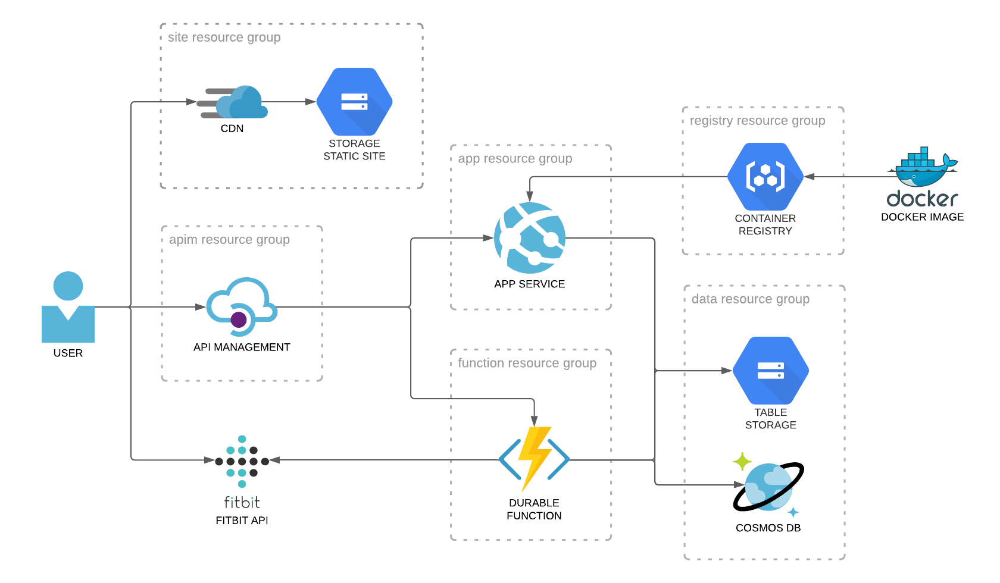

# Bitably app

An app for finding streaks in your Fitbit data, built on Azure:



## Setting up

Here's how to get the app up and running in your Azure subscription:

### Part 1: Build out the infrastructure

1. The first thing to do is to choose how you'd like to name your Azure resources. Here we'll name our resources using a typical five-part naming scheme:
   
    `environment-region-name-resource-instance`

    For example, the following resource name corresponds to a development environment, in the US East region, called `MyApp`, for the first instance of an Azure Container Registry: `dev-eus-myapp-acr-001`

2. Now that we know how we want to name our resources, the next step is to update our ARM template accordingly. At the top of the ARM template file `deploy/azuredeploy.json` edit the parameters `nameEnvironment`, `nameRegion`, `nameApp` using VS Code. Be sure to install the Azure Resource Manager (ARM) Tools for Visual Studio Code (Preview) extension so that you get the nice syntax highlighting and linting.

    In addition, set the subdomain of the CDN endpoint (the `cdnEndpointName` parameter) as you like and the API Management service's publishing info `apimPublisherEmail` and `apimPublisherName`. Finally, set the `rgLocation` parameter to the region that you'd like all the resources to be created in.

3. With the parameters set, let's deploy the ARM template to create all the resources (note that you'll need to use `az login` first to login to your subscription):
    ``` bash
    az deployment sub create --location WestUS --template-file deploy/azuredeploy.json   
    ```

4. After the resources have been provisioned, we need to turn on the static website capability of our blob storage account (since setting blob service properties is not supported in ARM templates). 
   
    Save the name of the storage account to a variable and then apply the change:

    ``` bash
    site_storage_name=$(az storage account list --query "[?ends_with(name,'sitestor01')].name" -o tsv)
    echo $site_storage_name

    az storage blob service-properties update --account-name $site_storage_name --static-website true --index-document index.html --404-document index.html 
    ```

5. We also need to set the CORS policy on our API. Go to the Azure Portal, navigate to the API Management instance, select `APIs` > `All APIs` > `Inbound processing` > `Add Policy` > `CORS` and save.

6. Next we need to tell Fitbit what our auth callback URL is, so let's grab the URL:

    ``` bash
    site_rg_name=$(az group list --query "[?ends_with(name,'-site01')].name" -o tsv)
    az storage account show -n $site_storage_name -g $site_rg_name --query "primaryEndpoints.web" --output tsv
    ```

    Then go to the Fitbit developer website and enter it as the `Redirect URL`. You can also add `http://localhost:4200` for local development.


7. The deployment settings for the app service aren't exactly right yet in the ARM template, so as a temporary workaround go to the app service > `Deployment Center` and set the `Image` to the option in the drop-down and set `Continuous Deployment` to On.

### Part 2: Deploy the API

First we need to edit the config file. Let's lookup our Cosmos DB name and access key, our storage account and access key, and our App Insights instrumentation key:

``` bash
data_rg_name=$(az group list --query "[?ends_with(name,'-data01')].name" -o tsv)
cosmos_name=$(az resource list --query "[?ends_with(name,'cos01')].name" -o tsv) 
cosmos_key=$(az cosmosdb keys list --name $cosmos_name --resource-group $data_rg_name --query "primaryMasterKey" -o tsv)
data_storage_name=$(az storage account list --query "[?ends_with(name,'datastor01')].name" -o tsv)
data_storage_key=$(az storage account keys list --account-name $data_storage_name  --resource-group $data_rg_name --query "[0].value" -o tsv)

app_rg_name=$(az group list --query "[?ends_with(name,'-app01')].name" -o tsv)
insights_name=$(az monitor app-insights component show --query "[?ends_with(name,'app01in')].name" -o tsv)
insights_key=$(az resource show -g $app_rg_name -n $insights_name --resource-type "microsoft.insights/components" --query properties.InstrumentationKey -o tsv)
```

Run the following command to generate the JSON and then copy it into the `api/config.json` file:

``` bash
echo '{
    "cosmos": {
        "endpoint": "https://'$cosmos_name'.documents.azure.com:443",
        "key": "'$cosmos_key'"
    },
    "storage": {
        "account": "'$data_storage_name'",
        "key": "'$data_storage_key'"
    },
    "appInsights": {
        "key": "'$insights_key'"
    }
}'
```

We use Docker containers to deploy our API to an Azure App Service. The following commands will lookup the name of our Azure Container Registry instance, create a new image, upload it to the ACR, and then build it. The build triggers a webhook that notifies the app service to deploy the code.

``` bash
acr_name=$(az acr list --query "[?ends_with(name,'acr01')].name" -o tsv)

cd api
az acr login --name $acr_name
docker build -t bitably-api .
docker tag bitably-api $acr_name.azurecr.io/bitably-api
az acr build --registry $acr_name --image bitably-api .
cd ..
```

When pushing updates later on you only need to run:
``` bash
az acr build --registry $acr_name --image bitably-api .
```

### Part 3: Deploy the SPA

First we need to edit the config file. Run the following commands to generate the contents of the file. The `fitbit_client_id` is the 6-character alpha-numeric ID provided to you when you register as a Fitbit developer.

``` bash
apim_name=$(az resource list --query "[?ends_with(name,'apim01')].name" -o tsv) 
site_rg_name=$(az group list --query "[?ends_with(name,'-site01')].name" -o tsv)
site_url=$(az storage account show -n $site_storage_name -g $site_rg_name --query "primaryEndpoints.web" --output tsv)
```

``` bash
echo '
export const environment = {
  production: true,
  apiUrl: "https://'$apim_name'.azure-api.net",
  websiteUrl: "'$site_url'",
  fitbitClientId: "<fitbit_client_id>"
};
'
```

Copy the output and paste it into the file `spa/src/environments/environment.prod.ts`. 

Also set the Fitbit client ID in the file `spa/src/environments/environment.ts`:

``` js
export const environment = {
  ...
  fitbitClientId: '<fitbit_client_id>'
};
```

Deploy the single page app to the storage static website:
``` bash
cd spa
npm run build
az storage blob upload-batch --account-name $site_storage_name -s ./dist/bitably -d '$web'
cd ..
```

### Part 4: Deploy the Function App

First we need to edit the config file. The following commands will find the name of the app service and then generate the contents of the config file:


``` bash
app_name=$(az webapp list --query "[?ends_with(name,'app01')].name" -o tsv)

echo '{
    "cosmos": {
        "endpoint": "https://'$cosmos_name'.documents.azure.com:443",
        "key": "'$cosmos_key'"
    },
    "storage": {
        "account": "'$data_storage_name'",
        "key": "'$data_storage_key'"
    },
    "fitbit": {
        "redirectUri": "https://'$app_name'.azurewebsites.net/auth-callback",
        "clientId": "<fitbit_client_id>",
        "secret": "<fitbit_client_secret>"
    }
}'
```

Copy the output of the above command and paste it into the file `functions/Fetch/config.json`.

Next we'll deploy the Function App. The following commands will find the names of the resource group and function app and then deploy it:

``` bash
func_rg=$(az group list --query "[?ends_with(name,'func01')].name" -o tsv)
func_name=$(az functionapp list --query "[?ends_with(name,'func01')].name" -o tsv)

zip functions.zip functions -r
az functionapp deployment source config-zip -g $func_rg -n $func_name --src functions.zip 
rm functions.zip
```

## Testing the app

Now that everything has been deployed, let's verify that it's up and running. Let's go to the CDN endpoint to load the SPA:

``` bash
cdn_rg=$(az group list --query "[?ends_with(name,'site01')].name" -o tsv)
cdn_name=$(az resource list --query "[?ends_with(name,'cdn01')].name" -o tsv)

az cdn endpoint list --profile-name $cdn_name --resource-group $cdn_rg --query '[0].hostName' -o tsv
```

This will give you the host name, so just add `https://` and test it out in browser. You should see the home page (if not, try reloading).

Click the `Register` button, login with your Fitbit credentials, select `Allow All` and click the `Allow` button. You should get redirected back to the app and see your name as registered with Fitbit and the number of days of data downloaded (which should be 0 initially).

## Running the Angular SPA locally

### Build

Run `ng build` to build the project. The build artifacts will be stored in the `dist/` directory. Use the `--prod` flag for a production build.

### Run locally

Run `ng serve` for a dev server. Navigate to `http://localhost:4200/`. The app will automatically reload if you change any of the source files.

### Run unit tests

Run `ng test` to execute the unit tests via [Karma](https://karma-runner.github.io).

## Running the Node API locally

### Build and run

You can run the API via Node directly:

``` s
npm run start
```

Or run the Docker image:
``` s
docker run --publish 80:80 bitably-api
```

## Miscellaney

### Building images in the ACR

In the above steps it's actually the Azure Container Registry that is building the Docker image for us. In addition to faster upload times (since we're just sending the source code), this also allows us to use a dev machine with an architecture (e.g. arm64) that differs from the amd64 architecture required by the Linux App Service. The alternative is to use Docker's `buildx` command to build an image for an arbitrary architecture, but it's not as simple.

### The Fitbit API

The documentation for the Fitbit API is located here:

https://dev.fitbit.com/build/reference/web-api/explore/
https://dev.fitbit.com/build/reference/web-api/oauth2/
